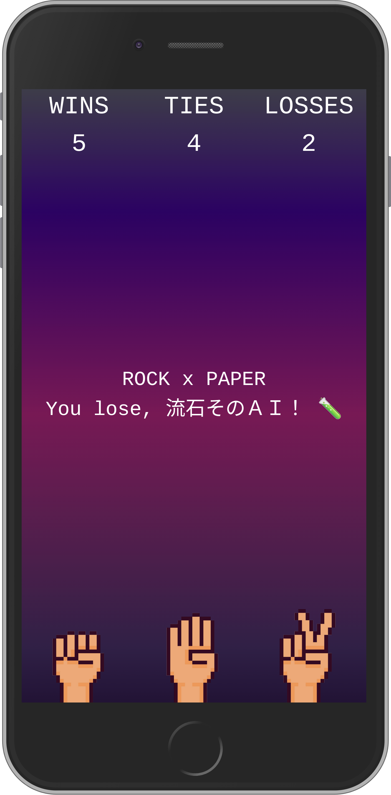
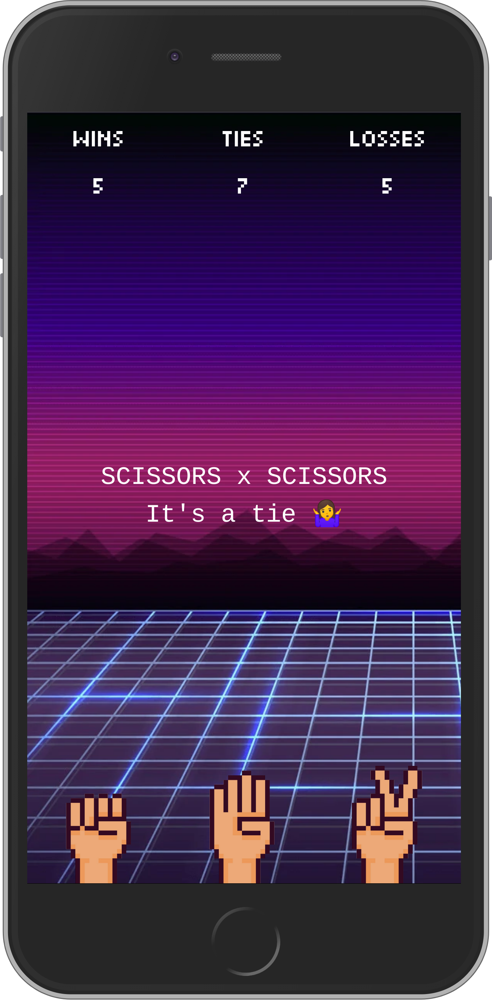

# Jajanken

[Live demo](https://www.jajanken.app/)

Disclaimer: this project is heavily inspired by [victorqribeiro/jokenpo](https://github.com/victorqribeiro/jokenpo/)

## Goal

After being intentionally away from artificial intelligence and machine learning for so long, I finally decided to start getting into this daunting field.  

Not really knowing where to start, I found inspiration from [this reddit post](https://www.reddit.com/r/gamedev/comments/b35tez/can_a_neural_network_beat_you_on_a_game_of_rock/) and started working from there.

## Getting started

```shell script
git clone git@github.com:m5r/jajanken.git
cd jajanken
npm install
npm run dev
```

## How it works

The app uses [Typescript](https://github.com/microsoft/TypeScript), [Next.js](https://github.com/zeit/next.js), [Preact](https://github.com/developit/preact) and [TailwindCSS](https://github.com/tailwindcss/tailwindcss) and is deployed to [ZEIT Now](https://zeit.co).

Most of the multilayer perceptron code comes from [victorqribeiro's implementation](https://github.com/victorqribeiro/jokenpo/blob/master/js/MLP.js), ported to Typescript.

Static assets are cached thanks to `next-offline` and with the whole app being static, you don't even need an internet connection to keep playing!

To make sure the app has the minimum acceptable elements to interact with it as soon as possible, some images have been converted to base64 and are inlined.  
This way, these small images get served with the initial markup and the browser has that much fewer requests to make.

Loading, yet interactive|Fully loaded
:---------------------------:|:---------------------------:
|

```shell script
find ./public/static/images -name "rock.png" -o -name "paper.png" -o -name "scissors.png" | parallel -eta "cat {} | base64 | tr -d '\n' > {}.b64"
```

When supported, the background is served as webp instead of png to further save bandwidth.

```shell script
~/Downloads/libwebp-1.0.3-linux-x86-64/bin/cwebp ./public/static/images/bg.png -o ./public/static/images/bg.webp -q 90 -m 6
```

### Next steps

~~The predictions being computed on the main thread, I would like to leverage [Web Workers](https://developer.mozilla.org/en-US/docs/Web/API/Web_Workers_API) to make sure performance stays good.~~

Being still far from understanding how the multilayer perceptron fully works, one of the next steps would be to dive deeper into it and probably make my own implementation entirely from scratch.
